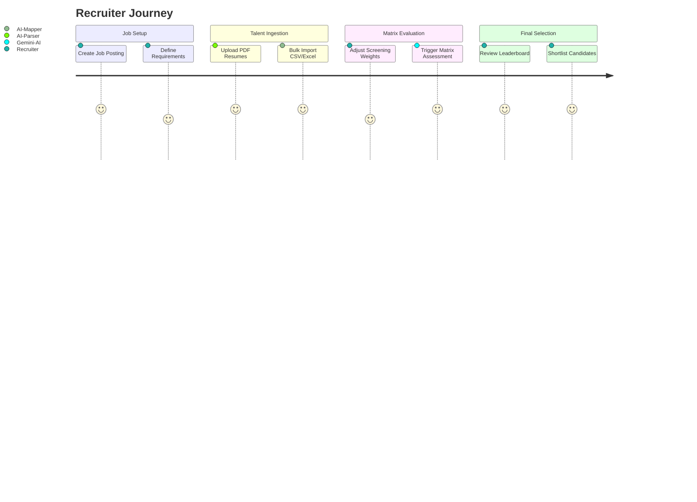
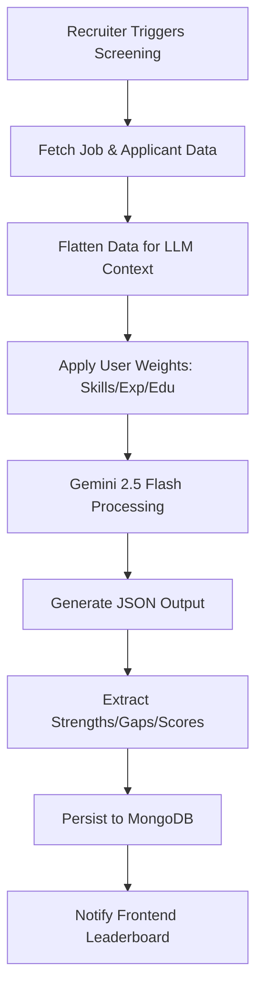

#  Recruitt - AI Talent Screening Platform

Recruitt is a powerful, high-performance talent acquisition engine designed to optimize the intelligence matrix for modern recruiters. It leverages **Gemini 2.5 Flash** for deep semantic analysis of resumes and job requirements.

##  Local Development

To get the full Recruitt engine running on your machine, follow these steps:

### 1. Prerequisites
- **Node.js**: v18.0.0 or higher
- **pnpm**: Fast, disk-space-efficient package manager
- **MongoDB**: A running instance (local or Atlas)
- **Gemini API Key**: Required for the AI screening pipeline

### 2. Installation
```bash
# Install dependencies for the entire monorepo
pnpm install
```

### 3. Environment Configuration
Create an `.env` file in `apps/server/.env`:
```env
PORT=5000
MONGODB_URI=your_mongodb_connection_string
GEMINI_API_KEY=your_gemini_api_key
```

### 4. Running the Platform
You can start all services (Frontend, Backend, and Docs) simultaneously from the root:
```bash
pnpm dev
```
- **Dashboard**: `http://localhost:3000`
- **Server**: `http://localhost:5000`
- **Docs**: `http://localhost:3001`

---

##  Technical Architecture

###  Recruiter User Flow
The frontend is designed for high-velocity decision making, focusing on clarity and AI explainability.



###  AI Decision Pipeline
The backend orchestrates semantic comparisons between talent profiles and job specifications using a weighted matrix approach.



---

##  Sub-Project Documentation

Explore more detailed documentation for each part of the platform:

- [🎨 **Frontend Dashboard**](apps/web/README.md) - Next.js 16 (App Router) + Tailwind 4
- [⚙️ **Backend Orchestrator**](apps/server/README.md) - Node.js + TypeScript + Mongoose
- [📚 **API Documentation**](apps/docs/README.md) - Built with Nuxt Content
- [📦 **Shared Library**](packages/shared/README.md) - Types and Talent Profile Specifications

---
© 2026 Recruitt Technologies. Optimizing the future of talent.
