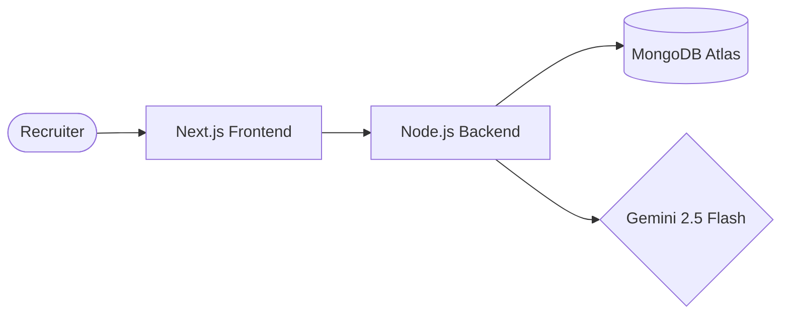

# Recruitt: AI Talent Screening Platform

Recruitt is an advanced AI-powered platform designed for the Umurava AI Hackathon. It streamlines the talent acquisition process by leveraging Gemini AI to accurately, transparently, and efficiently shortlist job applicants.

## 🌟 Core Features

- **Full Lifecycle Job Management**: Create, view, edit, and delete job openings with specialized metadata fields.
- **Smart Ingestion**: PDF resume parsing and bulk CSV/XLSX mapping using Gemini AI.
- **AI Screening Matrix**: Multi-candidate evaluation based on job-specific requirements.
- **Weighted Scoring**: Recruiter-controlled scoring priorities (Skills vs Experience vs Education).
- **Explainable Results**: Detailed AI reasoning for every match, including strengths and risks.
- **Human-in-the-Loop**: Integrated decision buttons for final shortlisting and rejection.

## 🧱 System Architecture



## 🛠️ Technology Stack

- **Language**: TypeScript
- **Frontend**: Next.js, Tailwind CSS 4, Shadcn/ui
- **Backend**: Node.js, Express, Mongoose, Multer
- **AI**: Gemini 2.5 Flash API
- **Infra**: MongoDB Atlas (Primary Database)

## 🏁 Getting Started

To get the full system running locally, you need to configure the environment variables for both the server and web applications.

### Prerequisites
- Node.js 20+
- pnpm 9+
- Gemini API Key

### Installation
```bash
# Install dependencies
pnpm install

# Start development environment
pnpm dev
```
