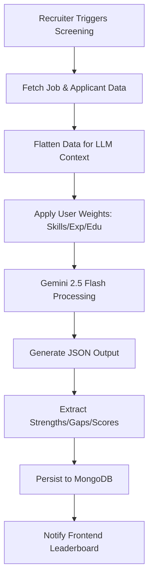

# 🚀 Recruitt Backend - Node.js + TypeScript

This is the core orchestration layer for the Recruitt platform. It handles data ingestion, AI evaluation logic, and result persistence.

## 🏗️ Core Architecture

The backend follows a Controller-Service pattern:
- **Controllers**: Handle HTTP requests and input validation (Zod). All controllers are documented with **JSDoc**.
- **Services**: Contain business logic and AI integration (Gemini).
- **Models**: Mongoose schemas enforcing the Talent Profile Specification.

## 🧠 AI Decision Flow

The screening process is orchestrated through high-level AI prompts that analyze semantic relevance between candidate profiles and job requirements.

## 📂 Key Folders

- `/controllers`: Request handlers for Jobs, Applicants, and Screening.
- `/services`: Gemini AI integrations and Resume/CSV parsing logic.
- `/models`: Shared data structures matching `db-schema.txt`.
- `/scripts`: Database seeding and testing utilities.

## 🧪 Testing & Dummy Data

To test the bulk upload feature, you can find a sample CSV file in this directory:
- **Location**: `apps/server/dummy_applicants.csv`
- **Usage**: Upload this file in the `Add multiple applicants` section of the web dashboard.

## 🛠️ Setup

1. Copy `.env.example` to `.env`.
2. Add your `GEMINI_API_KEY` and `MONGODB_URI`.
3. Run `pnpm dev` to start the development server.

## 📡 Key Endpoints

- `POST /api/screening/trigger/:jobId`: Starts the AI analysis for a job.
- `PATCH /api/screening/result/:id/status`: Manual shortlisting decision.
- `POST /api/applicants/bulk`: AI-powered CSV/XLSX ingestion.
