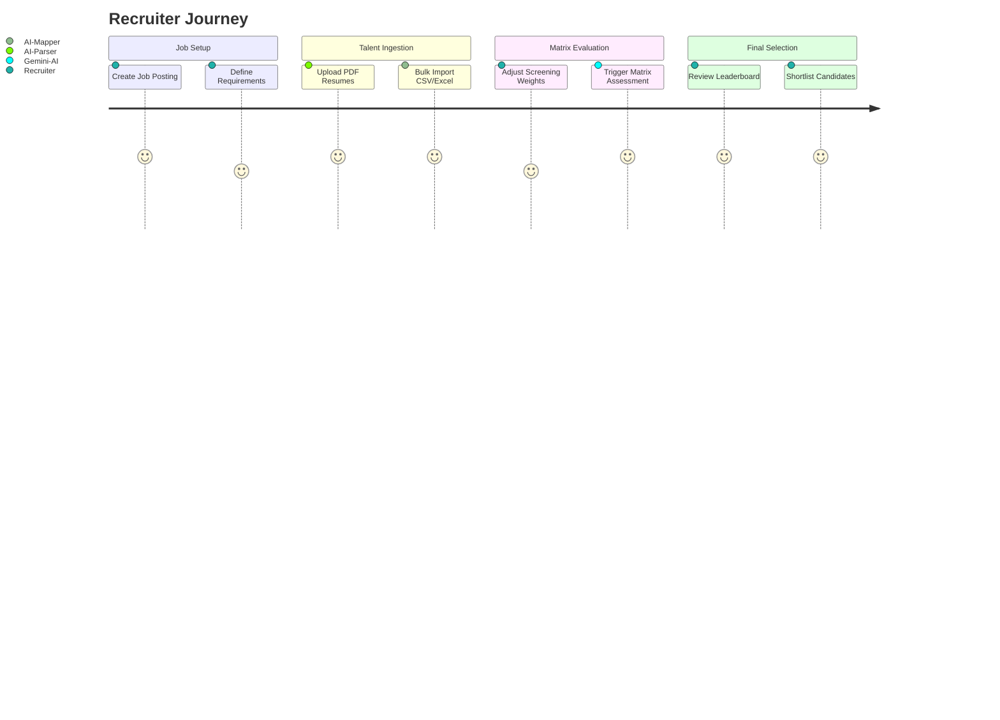

# 🎨 Recruitt Frontend - Next.js (App Router)

A high-performance, recruiter-facing dashboard built for at-a-glance decision making and AI orchestration.

## 🚀 Design Principles

- **Speed**: Built on Next.js 16 with Turbo for instant feedback.
- **Explainability**: Every AI rank is justified with strengths, gaps, and recommendations.
- **Interaction**: Advanced sliders for matrix weighting and human-in-the-loop controls.

## 🗺️ User Flow

## 🛠️ Components

- **AI Ingestion Engine**: Handles file drops and multi-format parsing.
- **Matrix Leaderboard**: Visualizes match scores and AI-generated reasoning.
- **Screening Settings**: Accordion-based UI for fine-tuning the AI's priority weights.

## 📂 Structure

- `/app`: Next.js App Router routes (Jobs, Applicants, Screening).
- `/components/custom`: High-level business components (Leaderboard, Upload).
- `/components/ui`: Atomic design elements (Shared with monorepo).
- `/lib/api`: Centralized API bridge for backend communication.

## 🎨 Styling

- **Tailwind CSS 4**: Modern, utility-first styling.
- **Shadcn UI**: Premium component base.
- **Tabler Icons**: Consistent iconography for better UX.
